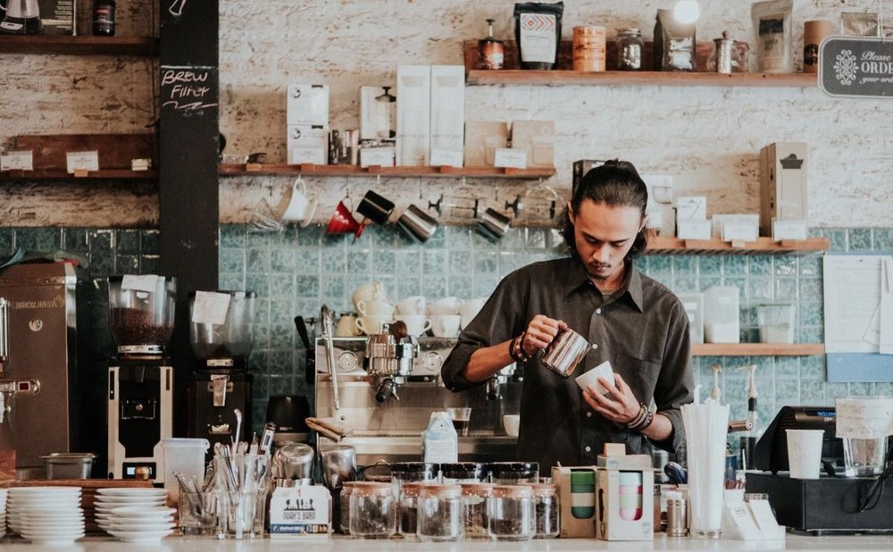

**팀원**: 김예진, 박동화

**구현 의도** : 원래 커피를 좋아하고 나중에 바리스타가 되어서 카페를 창업하는게 목표여서 카페 페이지를 만들게 되었습니다. 미리 제 카페 페이지를 만드는 느낌이여서 제가 카페를 창업했을 때 어떤 식으로 손님에게 제 카페에 대한 철학을 보여줄지에 대해 많은 고민을 했고 특히 about naru 와 coffee_drink 페이지를 제대로 보여줄려고 머리를 썼습니다.

**역할 분담 내용 **: 예진님이 이미지 쪽에 상당한 능력이 있어서 그런지 초반에 카페 아이콘이나 페이지 아이콘에 대한 진도가 빨리 빠져서 페이지를 만드는데 수월했습니다. 그래서 음료와 사진을 부탁했고 저는 제 카페이다 보니 카페에 대한 설명과 커피의 전체적인 정보에 대해 수집을 많이 해서 구현했습니다.

**오류 내용** : 확실히 부트스트랩을 쓰면 div.row나 container사용할 때 편리한데 불편한 점도 있습니다. 매번 row만 쓰면 각각의 div에 다른 기능을 구현시키지 못해서 row1이라던지 다른 이름을 쓰는데 그런 부분을 고치느라 애를 먹었습니다. 
예를 들어

            <h1 class="naru1"><strong>Naru 1. 꾸준한 테스트와 관리로 유지되는 커피</strong></h1>
            

                
                
  저희 바리스타들은 커피를 드릴 때 샷을 뽑은 후 약간의 입가심할 정도만 마셔보며 항상 테스팅하고 있습니다. 현재 원두의 상태는 어떤지, 커피 머신의 압력은 잘 맞춰져 있는지를 알아보며 손님에게 양질의 커피를 제공하고 있습니다. 그리고 연결되어 있는 로스팅 회사에게 저희가 도전하고 싶은 원두들을  블렌딩 주문을 하며 도태되지 않고 향상하는 맛을 내기 위해 최선을 다하고 있습니다.

            

        

이 부분에도 제가 사진을 오른쪽에다 하고 이미지 왼쪽에 텍스트를 쓰고 싶었는데 그전에 align="left"를 했던 것처럼 했지만 안됐습니다. 왠지는 모르겠지만 p 클래스보다 img를 먼저 써야 되었습니다. 이게 row1탓인지 아니면 그냥 제 탓인지도 헷갈렸습니다. 결국 다 고쳤습니다!

**간단한 소감**: 확실히 제 페이지를 만드는 것이니까 열정도 생겨서 만드는데는 보람이 있는 작업이였습니다. 이 repository를 볼 때마다 많은 생각이 날 것같습니다.

**참고문서** : 커피를 좋아하지만 커피에 대한 지식이 별로 없어서 
대표적인 카페 할리스커피와 스타벅스, 이디야 홈페이지를 참고했습니다.
http://www.istarbucks.co.kr/index.do
https://ediya.com/contents/drink.html
http://www.hollys.co.kr/hollysIs/hollys/aboutHollys.do

